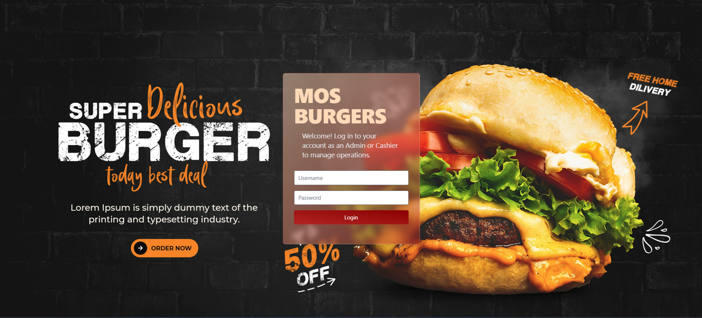

# MOS Burger Full Stack Project 🍔

Welcome to the **MOS Burger Full Stack Project**! This is a full-stack web application built with modern technologies to deliver a seamless user experience. Below, you'll find details about the tech stack, functionalities, and instructions to set up and run the project locally.

---

## **Tech Stack** 🛠️

### Backend
- **Spring Boot**: For building robust and scalable backend services.
- **Hibernate**: For ORM (Object-Relational Mapping) and database interactions.
- **MySQL**: As the relational database for storing application data.
- **AWS S3 Bucket**: For storing and retrieving images.
- **Lombok**: For reducing boilerplate code.
- **Dependency Injection**: For managing dependencies efficiently.
- **Layered Architecture**: For clean and maintainable code structure.

### Frontend
- **AngularJS**: For building dynamic and responsive user interfaces.
- **Tailwind CSS**: For styling and designing the frontend.
- **Angular OAuth**: For secure user authentication.
- **Angular Routing**: For seamless navigation between pages.
- **Two-Way Binding**: For dynamic data synchronization between the view and model.

---

## **Key Features** ✨

1. **Image Upload to AWS S3 Bucket**:
   - Users can upload images, which are stored in an AWS S3 bucket.
   - The image URL is retrieved and stored in the database for future use.

2. **Database Integration**:
   - MySQL is used to store application data.
   - Hibernate simplifies database interactions and ensures data consistency.

3. **User Authentication**:
   - Angular OAuth is implemented for secure user login and registration.

4. **Responsive UI**:
   - Tailwind CSS ensures a clean and responsive design.
   - AngularJS provides a dynamic and interactive user experience.

5. **Layered Architecture**:
   - The application is built with a clean, maintainable, and scalable architecture.

---

## **How to Run the Project** 🚀

### Prerequisites
- **Java JDK** (for backend)
- **Node.js** and **npm** (for frontend)
- **MySQL** database
- **AWS S3 Bucket** (for image storage)
- **IntelliJ IDEA** (for backend)
- **VS Code** (for frontend)

---

### **Backend Setup**

1. **Clone the Repository**:
   ```bash
   git clone https://github.com/RameshEdirisinghe/MOS-BURGERS-FULL-PROJECT.git
   ```

2. **Navigate to the Backend Folder**:
   ```bash
   cd MOS-BURGERS-FULL-PROJECT/MOS burger Backend
   ```

3. **Open the Project in IntelliJ IDEA**:
   - Import the project as a Maven project.
   - Navigate to `pom.xml` and perform a **clean install**:
     ```bash
     mvn clean install
     ```

4. **Run the Backend**:
   - Start the Spring Boot application from IntelliJ IDEA.

---

### **Frontend Setup**

1. **Navigate to the Frontend Folder**:
   ```bash
   cd MOS-BURGERS-FULL-PROJECT/MOS burger Frontend
   ```

2. **Install Dependencies**:
   ```bash
   npm install
   ```

3. **Run the Frontend**:
   ```bash
   ng serve
   ```

4. **Access the Application**:
   - Open your browser and go to `http://localhost:4200`.

---

## **Screenshots** 📸

Here are some screenshots of the application:

### Login Page


### Dashboard Page


### User Authentication


---

## **Contributing** 🤝

If you'd like to contribute to this project, feel free to fork the repository and submit a pull request. Your contributions are always welcome!

---

Enjoy exploring the **MOS Burger Full Stack Project**! If you have any questions or feedback, feel free to reach out. 😊
